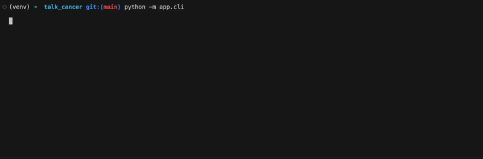

[](https://github.com/duggie/talk_cancer/actions/workflows/ci.yml)

---

# talk_cancer
LLM RAG project to provide a conversational interface to support information for people [in Northern Ireland/Ireland/UK] affected by a cancer diagnosis

## Dependencies

This project uses **[python 3.14](https://www.python.org/downloads/release/python-3140/)**.

## Setup

(Assumes you are using macOS.)

```
brew install pyenv
pyenv install 3.14
pyenv local 3.14
python --version  # Python 3.14.2
python -m venv venv
source venv/bin/activate
python --version  # Python 3.14.2
```

## Usage

```
pip install requirements.txt requirements-dev.txt
python app.cli
```

## CLI Demo

In order to test the approach, a terminal <abbr title="Command Line Interface">CLI</abbr> version has been created to interact with the LLM.

A proper web-based user interface and User Experience is on the roadmap.



(Terminal window recorded with [QuickTime](https://en.wikipedia.org/wiki/QuickTime), then animated using [ffmpeg](https://www.ffmpeg.org).)

**What the demo shows:**
1. Running the CLI tool (python script)
1. User providing their question as text input.
1. App consuming the user question and replying with a natural language response, sympathetic and tailored towards a user located in Northern Ireland.

---

## Test Coverage

```
NName                                Stmts   Miss Branch BrPart  Cover
---------------------------------------------------------------------
app/__init__.py                         0      0      0      0   100%
app/assistant_service.py               10      0      0      0   100%
app/cli.py                             21      0      4      0   100%
app/llm_base.py                        12      0      0      0   100%
app/llm_ollama.py                      35      0      8      0   100%
tests/test_cli.py                      66      0      0      0   100%
tests/test_llm_base.py                  9      0      0      0   100%
tests/test_ollama_chat_model.py        91      0      2      0   100%
tests/test_story_1_1_assistant.py      31      0      0      0   100%
---------------------------------------------------------------------
TOTAL                                 275      0     14      0   100%
============================== 10 passed in 0.18s ==============================
```